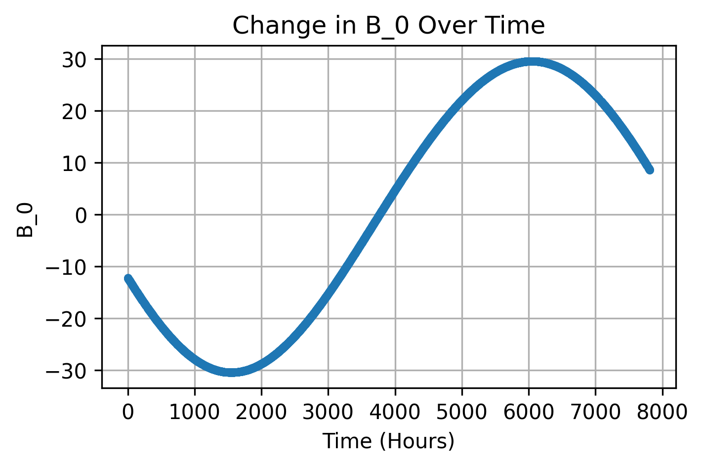
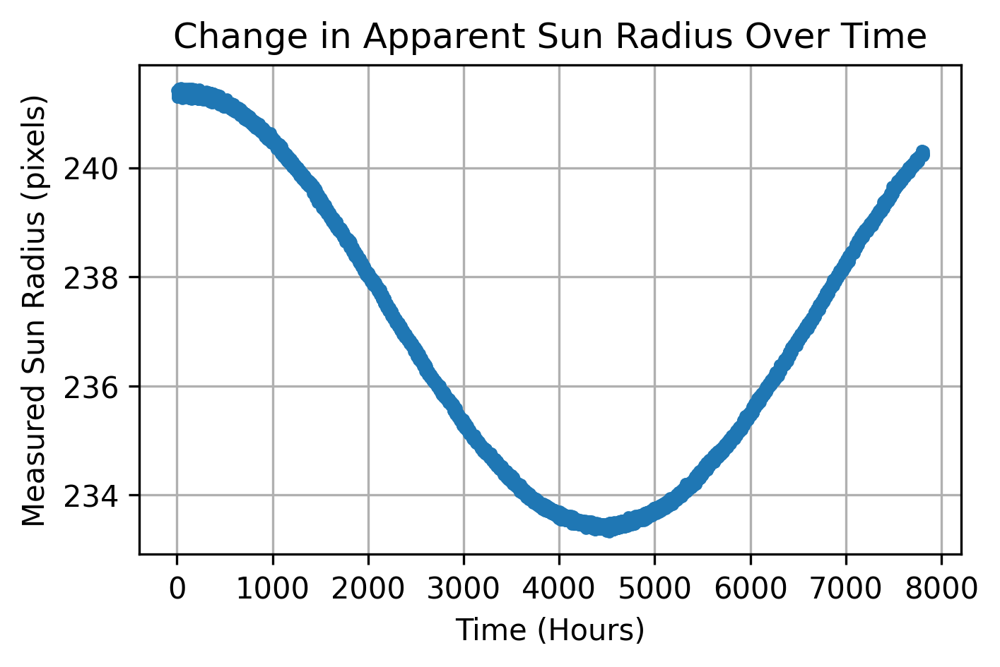
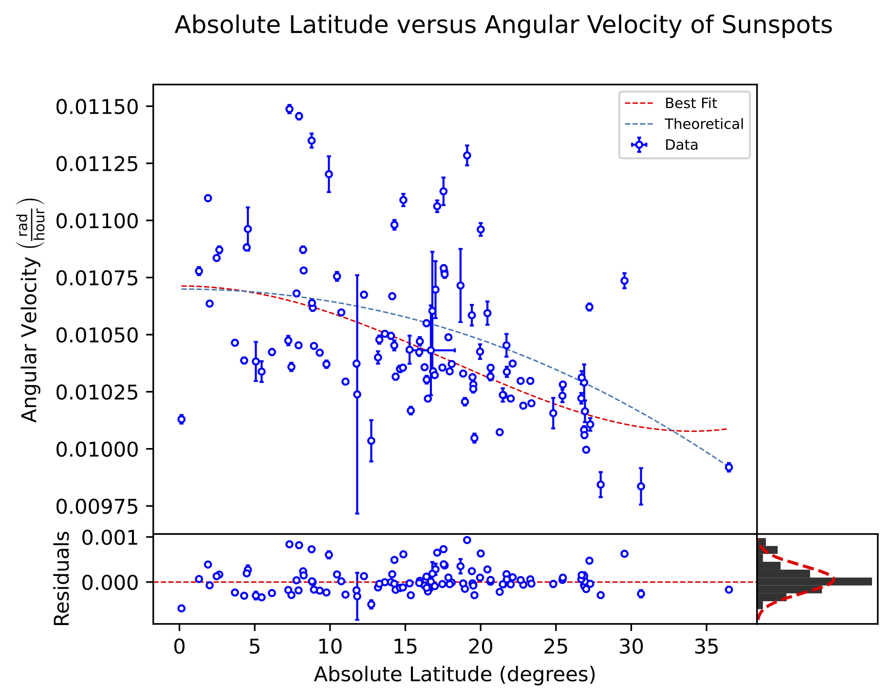

# Solar Differential Rotation Analysis and Sunspot Tracker
Quantifying the Sun's differential rotation rate by implementing 3D heliographic coordinate transformations on SDO spacecraft data to track sunspot migration.

## Project Overview
Unlike a solid body, the Sun rotates faster at its equator than at its poles. This differential rotation is fundamental to the solar dynamo and the generation of magnetic fields. 

Sunspots are temporary phenomena on the Sun's photosphere that appear as dark spots caused by concentrations of magnetic flux that inhibit convection. Crucially they maintain a fixed latitude throughout their lifetime. This characteristic makes them ideal for measuring the rotation rate of the Sun at specific latitudes.

This projects analyzes 5,000+ images taken from January to December 2024 by the Solar Dynamics Observatory (SDO) to locate, track, and analyze 110+ sunspots. The created program detects sunspots, transforms their 2D pixel coordinates into 3D heliographic coordinates, and determines their latitude and angular velocity. 

<p align="center">
  
  <br>
  <sub>Animation of images taken by SDO's HMI instrument.</sub>
</p>

## Data Used
The data consisted of Full-Disk Continuum images captured by the Helioseismic and Magnetic Imager (HMI) on board NASA's SDO spacecraft. The images were downloaded from the [SOHO/SDO Data Archive](https://soho.nascom.nasa.gov/sunspots/). Each resolution for each image was 512x512. 

The $B_0$ values for the SDO spacecraft were downloaded using [JPL's Horizons System](https://ssd.jpl.nasa.gov/horizons/app.html#/).

## Sunspot Tracking
### Locating Sunspots 
The method for tracking sunspot motion consists of creating a detection box around the initial position of the sunspot. The darkest pixel inside the detection box is taken to be the pixel coordinates of the sunspot. The next image in the sequence is loaded and the detection box is centered on the new position and the new darkest pixel coordinate is checked. This process is repeated for all images in the sequence and stored in a csv file. 

For each image the distance of the sunspot from the center of the Sun is taken to be $d$. This is the main value being plotted when examining the motion of the sunspot over time.

### Modeling Sunspot Motion

The initial model equation for the sunspot motion was 

$$
d(\omega, t) = \sqrt{\left(R_\text{Sun}^2 - \delta^2\right) \sin ^2 (\omega [t- t_0]) + \delta^2},
$$

where $R_\text{Sun}$ was a fixed value, $\delta$ is the latitude of the sunspot, $\omega$ is the angular velocity of the sunspot, and $t_0$ is the time offset. 

However, because the SDO spacecraft is orbiting Lagrange Point 1, its distance and inclination relative to the Sun changes over time. Using the data from JPL's Horizons System and gathering the Sun's radius for every image shows that these values change by a substantial amount and need to be considered in the model equation.

<p align="center">
  
  <br>
  <sub>The change in $B_0$ over the dataset.</sub>
</p>

<p align="center">
  
  <br>
  <sub>The variability of the Sun's radius over the dataset</sub>
</p>

The final model equation takes into account the foreshortening effects of imaging a sphere with a 2-dimensional image in both the x and y axes. It also treats $R_\text{Sun}(t)$ and $B_0(t)$ as values that vary over time.

$$X(t) = (R_{\text{Sun}}^2(t)- \delta ^2)\sin^2(\omega[t-t_{0}])$$
$$Y(t) = R_{\text{Sun}}(t)[\sin(\delta)\cos(B_{0}(t))-\cos(\delta)\sin(B_{0}(t))\cos(\omega(t-t_{0}))]$$
$$d(\omega,t) = \sqrt{X(t)^2 + Y(t)^2}= \sqrt{\left((R_\text{Sun}(t)^2- \delta ^2)\sin^2(\omega[t-t_{0}])\right)^2 +   \left(R_\text{Sun}(t)[\sin(\delta)\cos(B_{0}(t))-\cos(\delta)\sin(B_{0}(t)\cos(\omega(t-t_{0}))]\right)^2}.$$

### $\chi ^2$ Minimization
Using $\chi ^2$ analysis on the model equation, the varied parameters are $\delta$, $\omega$, and $t_0$. For each sunspot a best fit curve is calculated, the optimized parameters are recorded, and the following graph is created.


sidereal versus other.

## Differential Rotation Analysis
### Model Equation
$$
\omega = \text{A} + \text{B}\sin^2(\varphi) + \text{C} \sin ^4 (\varphi).
$$

use $\chi ^2$ minimization to determine A, B, and C. 

### Error Analysis
$$
\alpha _j = \sqrt {C_{jj}}.
$$

### Final Results
<p align="center">
  
  <br>
  <sub>Latitude versus angular velocity for each sunspot examined.</sub>
</p>


<p align="center">
  
  <br>
  <sub>Animation of images taken by SDO's HMI instrument.</sub>
</p>


## Methodology
The pipeline consists of two primary stages: **Feature Extraction** and **Velocity Modeling**.

### 1. Image Processing & Coordinate Transformation
Raw images are processed to identify sunspots using intensity thresholding and contour detection. To convert 2D image coordinates $(x, y)$ into physical 3D Heliographic coordinates (Latitude $\phi$, Longitude $L$), the pipeline applies rigorous geometric corrections:

* **Spherical Projection Correction:** Corrects for foreshortening near the solar limb, where sunspots appear compressed.
* **Carrington Elements:** Accounts for the Earth's changing viewing angle:
    * **$B_0$ Angle:** The tilt of the Sun's rotational axis toward Earth (Heliographic latitude of the central point).
    * **$L_0$ Angle:** The Heliographic longitude of the central meridian.
    * **$P$ Angle:** The position angle of the solar north pole.
* **Earth-Sun Distance Variation:** Corrects for the change in the Sun's apparent angular radius ($\sim$31.6' to $\sim$32.7') due to Earth's elliptical orbit.

### 2. Tracking & Fitting
Sunspots are tracked across consecutive frames. The angular velocity $\omega$ is calculated for each track and fitted to the standard solar differential rotation law:

$$\omega(\phi) = A + B \sin^2(\phi) + C \sin^4(\phi)$$

Where:
* $A$: Equatorial rotation rate.
* $B, C$: Differential rotation coefficients (typically negative, indicating slower rotation at poles).

## Results
The pipeline successfully recovered the Sun's differential rotation profile.

* **Equatorial Rotation ($A$):** Calculated as **$0.0107$ units** (approx. 25-day period), matching theoretical values with a **0.12% difference**.
* **Differential Gradient:** Confirmed the latitude-dependent velocity decrease, with tracking data showing distinct bands of slower rotation at higher latitudes.

<p align="center">
  
  <br>
  <sub>Fit of Solar Latitude vs. Angular Velocity. The red line represents the differential rotation model $\omega(\phi) = A + B \sin^2(\phi) + C \sin^4(\phi)$.</sub>
</p>

## Instructions to Run
1.  **Clone the repository:**
    ```bash
    git clone [https://github.com/Singh-Mehtab/solar-rotation-analysis.git](https://github.com/Singh-Mehtab/solar-rotation-analysis.git)
    ```
2.  **Install dependencies:**
    ```bash
    pip install -r requirements.txt
    ```
    *(Requires `numpy`, `matplotlib`, `opencv-python`, `scipy`, `pandas`)*

3.  **Run the analysis:**
    * Run `notebooks/sunspot_tracking.ipynb` to process images and generate coordinate data.
    * Run `notebooks/solar_rotation.ipynb` to perform the curve fitting and generate plots.

## Acknowledgments
* Data courtesy of NASA/SDO and the HMI science team.
* Carrington element calculations based on standard solar coordinate algorithms.