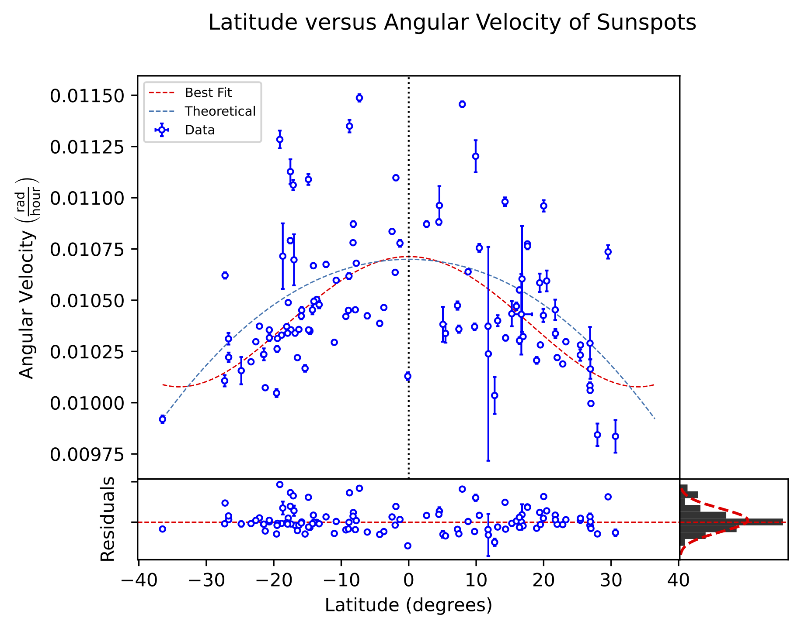

# Solar Differential Rotation Analysis and Sunspot Tracker
Quantifying the Sun's differential rotation rate by implementing 3D heliographic coordinate transformations on SDO spacecraft data to track sunspot migration.

## Project Overview
Unlike a solid body, the Sun rotates faster at its equator than at its poles. This differential rotation is fundamental to the solar dynamo and the generation of magnetic fields. 

Sunspots are temporary phenomena on the Sun's photosphere that appear as dark spots caused by concentrations of magnetic flux that inhibit convection. Crucially they maintain a fixed latitude throughout their lifetime. This characteristic makes them ideal for measuring the rotation rate of the Sun at specific latitudes.

This projects analyzes 5,000+ images taken from January to December 2024 by the Solar Dynamics Observatory (SDO) to locate, track, and analyze 110+ sunspots. The created program detects sunspots, transforms their 2D pixel coordinates into 3D heliographic coordinates, and determines their latitude and angular velocity. 

<p align="center">
  
  <br>
  <sub>Animation of images taken by SDO's HMI instrument.</sub>
</p>

## Sunspot Tracking
### Locating Sunspots 
Detection Box
### Modeling Sunspot Motion

$$X(t) = (R_{\text{Sun}}^2(t)- \delta ^2)\sin^2(\omega[t-t_{0}])$$
$$Y(t) = R_{\text{Sun}}(t)[\sin(\delta)\cos(B_{0}(t))-\cos(\delta)\sin(B_{0}(t))\cos(\omega(t-t_{0}))]$$
$$d_{m}(\omega,t) = \sqrt{X(t)^2 + Y(t)^2}= \sqrt{\left((R_\text{Sun}(t)^2- \delta ^2)\sin^2(\omega[t-t_{0}])\right)^2 +   \left(R_\text{Sun}(t)[\sin(\delta)\cos(B_{0}(t))-\cos(\delta)\sin(B_{0}(t)\cos(\omega(t-t_{0}))]\right)^2},$$

Graphs for B_0 and solar radius

### $\chi ^2$ Minimization

Show graph with residuals. 
The optimized parameters are $\delta$ and $\omega$. this gives the latitude and angular velocity. 

sidereal versus other.

## Differential Rotation Analysis
### Model Equation
$$
\omega = \text{A} + \text{B}\sin^2(\varphi) + \text{C} \sin ^4 (\varphi).
$$

use $\chi ^2$ minimization to determine A, B, and C. 

### Error Analysis
$$
\alpha _j = \sqrt {C_{jj}}.
$$

### Final Results
<p align="center">
  
  <br>
  <sub>Latitude versus angular velocity for each sunspot examined.</sub>
</p>


<p align="center">
  
  <br>
  <sub>Animation of images taken by SDO's HMI instrument.</sub>
</p>

## Data Collection
The dataset consists of **Full-Disk Continuum** images captured by the **Helioseismic and Magnetic Imager (HMI)** on board NASA's **SDO** spacecraft.
* **Source:** [SOHO/SDO Data Archive](https://soho.nascom.nasa.gov/sunspots/)
* **Volume:** ~5,000 images spanning a 12-month period.
* **Resolution:** 512x512 (downsampled for processing efficiency).

## Methodology
The pipeline consists of two primary stages: **Feature Extraction** and **Velocity Modeling**.

### 1. Image Processing & Coordinate Transformation
Raw images are processed to identify sunspots using intensity thresholding and contour detection. To convert 2D image coordinates $(x, y)$ into physical 3D Heliographic coordinates (Latitude $\phi$, Longitude $L$), the pipeline applies rigorous geometric corrections:

* **Spherical Projection Correction:** Corrects for foreshortening near the solar limb, where sunspots appear compressed.
* **Carrington Elements:** Accounts for the Earth's changing viewing angle:
    * **$B_0$ Angle:** The tilt of the Sun's rotational axis toward Earth (Heliographic latitude of the central point).
    * **$L_0$ Angle:** The Heliographic longitude of the central meridian.
    * **$P$ Angle:** The position angle of the solar north pole.
* **Earth-Sun Distance Variation:** Corrects for the change in the Sun's apparent angular radius ($\sim$31.6' to $\sim$32.7') due to Earth's elliptical orbit.

### 2. Tracking & Fitting
Sunspots are tracked across consecutive frames. The angular velocity $\omega$ is calculated for each track and fitted to the standard solar differential rotation law:

$$\omega(\phi) = A + B \sin^2(\phi) + C \sin^4(\phi)$$

Where:
* $A$: Equatorial rotation rate.
* $B, C$: Differential rotation coefficients (typically negative, indicating slower rotation at poles).

## Results
The pipeline successfully recovered the Sun's differential rotation profile.

* **Equatorial Rotation ($A$):** Calculated as **$0.0107$ units** (approx. 25-day period), matching theoretical values with a **0.12% difference**.
* **Differential Gradient:** Confirmed the latitude-dependent velocity decrease, with tracking data showing distinct bands of slower rotation at higher latitudes.

<p align="center">
  
  <br>
  <sub>Fit of Solar Latitude vs. Angular Velocity. The red line represents the differential rotation model $\omega(\phi) = A + B \sin^2(\phi) + C \sin^4(\phi)$.</sub>
</p>

## Instructions to Run
1.  **Clone the repository:**
    ```bash
    git clone [https://github.com/Singh-Mehtab/solar-rotation-analysis.git](https://github.com/Singh-Mehtab/solar-rotation-analysis.git)
    ```
2.  **Install dependencies:**
    ```bash
    pip install -r requirements.txt
    ```
    *(Requires `numpy`, `matplotlib`, `opencv-python`, `scipy`, `pandas`)*

3.  **Run the analysis:**
    * Run `notebooks/sunspot_tracking.ipynb` to process images and generate coordinate data.
    * Run `notebooks/solar_rotation.ipynb` to perform the curve fitting and generate plots.

## Acknowledgments
* Data courtesy of NASA/SDO and the HMI science team.
* Carrington element calculations based on standard solar coordinate algorithms.